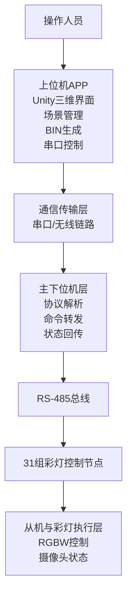
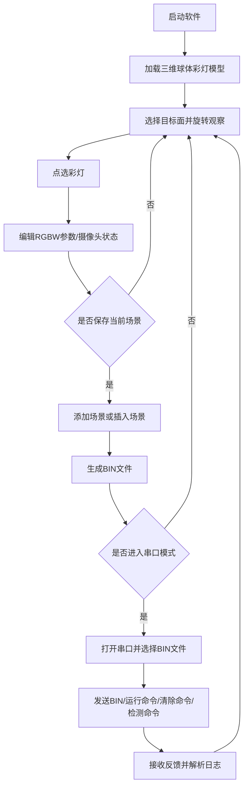
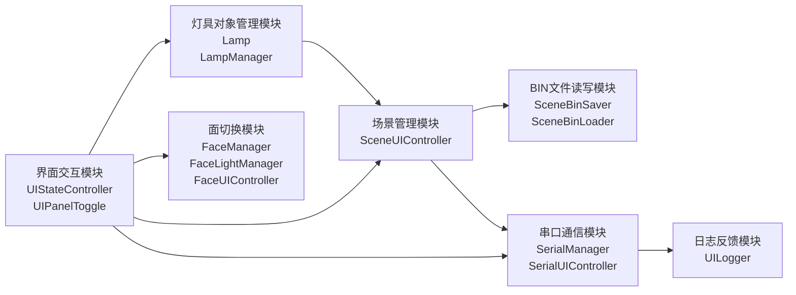
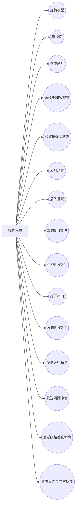

# 论文配图说明

本文档用于配合毕业论文插图绘制与正文撰写，依据当前 `Graduation project` 项目代码、开题报告和设计图整理而成。建议优先在论文第二章和第四章使用以下四张核心图。

## 图2-1 彩灯控制系统总体结构图

图题建议：`图2-1 彩灯控制系统总体结构图`

建议放置章节：`第二章 2.4 系统总体方案` 后。

正文引用示例：

“如图2-1所示，彩灯控制系统整体采用分层结构，由用户层、上位机软件层、通信传输层、主下位机层和从机执行层构成。上位机负责参数配置、场景组织与命令下发，主下位机负责协议解析和分组转发，从机节点负责具体彩灯执行与状态反馈。”

图中应包含的要素：

1. 操作人员
2. Unity三维可视化界面
3. 场景管理与BIN生成模块
4. 串口控制与日志反馈模块
5. 无线链路或串口到主下位机的通信链路
6. RS-485总线
7. 31组主下位机
8. 组内从机与彩灯节点

参考结构图：

## 图2-2 上位机软件工作流程图

图题建议：`图2-2 上位机软件工作流程图`

建议放置章节：`第二章 2.5 业务流程设计` 后。

正文引用示例：

“如图2-2所示，系统工作流程可分为场景编辑和联机下发两条主线。用户首先在模型中选择目标面并编辑单灯参数，随后决定是否将当前状态保存为场景；当场景组织完成后，系统生成BIN文件并进入串口模式完成文件发送、命令下发和反馈解析。”

图中应包含的要素：

1. 软件启动
2. 加载三维模型
3. 选择面并观察彩灯
4. 选中彩灯并编辑参数
5. 是否保存当前场景
6. 场景新增或插入
7. 生成BIN文件
8. 是否进入串口模式
9. 打开串口并发送文件
10. 下发运行、清除或检测命令
11. 反馈解析与日志显示

参考流程图：

## 图4-1 上位机软件功能模块图

图题建议：`图4-1 上位机软件功能模块图`

建议放置章节：`第四章 4.1 系统模块划分` 后。

正文引用示例：

“如图4-1所示，上位机软件采用模块化组织方式，主要包含界面交互模块、灯具对象管理模块、面切换模块、场景管理模块、BIN文件读写模块、串口通信模块和日志反馈模块。各模块之间通过统一的数据结构和事件机制协同工作。”

图中应包含的要素：

1. 界面交互模块：`UIStateController`、`UIPanelToggle`
2. 灯具对象管理模块：`Lamp`、`LampManager`
3. 面切换模块：`FaceManager`、`FaceLightManager`、`FaceUIController`
4. 场景管理模块：`SceneUIController`
5. 文件读写模块：`SceneBinSaver`、`SceneBinLoader`
6. 串口通信模块：`SerialManager`、`SerialUIController`
7. 日志反馈模块：`UILogger`

参考模块图：

## 图2-3 上位机软件用例图

图题建议：`图2-3 上位机软件用例图`

建议放置章节：`第二章 2.2 功能需求分析` 后或 `2.6 论文配图设计说明` 后。

正文引用示例：

“如图2-3所示，从用户视角看，上位机系统主要完成模型观察、参数编辑、场景管理和串口联调四类任务。用例图说明了系统的功能边界，也为后续模块划分和测试内容设计提供了需求依据。”

图中应包含的要素：

1. 参与者：操作人员
2. 旋转模型
3. 选择面
4. 选中彩灯
5. 编辑RGBW参数
6. 设置摄像头状态
7. 添加场景
8. 插入场景
9. 加载BIN
10. 生成BIN
11. 打开串口
12. 发送BIN
13. 发送运行命令
14. 发送清除命令
15. 发送线路检查命令
16. 查看日志与异常反馈

参考用例图：

## 插图落位建议

建议在论文中按以下顺序放图：

1. 第二章放 `图2-1 彩灯控制系统总体结构图`
2. 第二章放 `图2-2 上位机软件工作流程图`
3. 第二章放 `图2-3 上位机软件用例图`
4. 第四章放 `图4-1 上位机软件功能模块图`

如果你后面愿意，我还可以继续帮你把这四张图直接画成适合论文截图使用的黑白简洁版。
